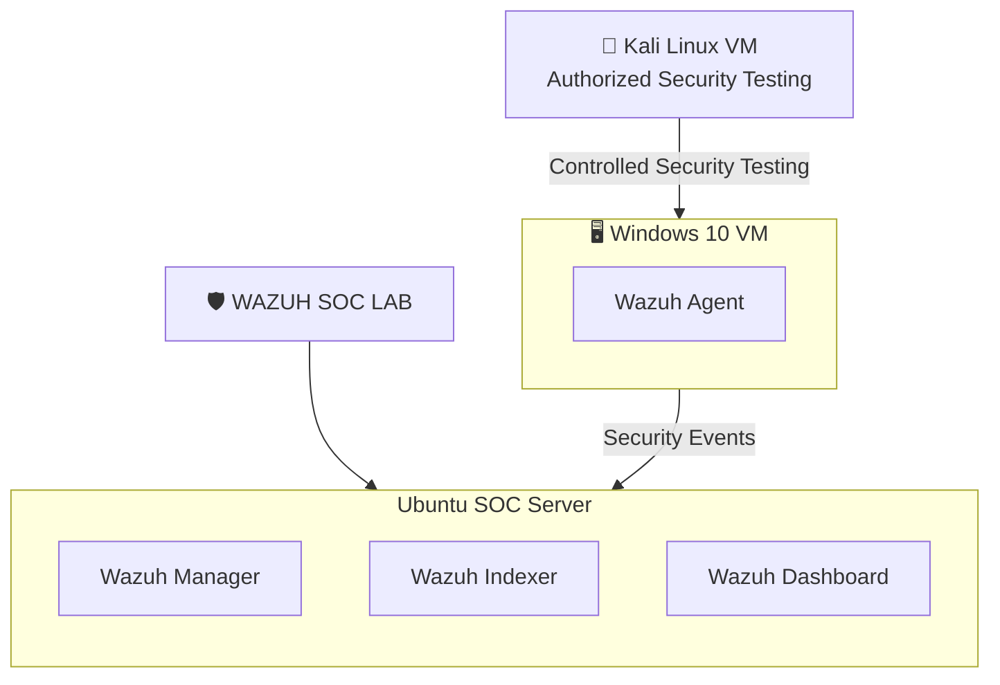
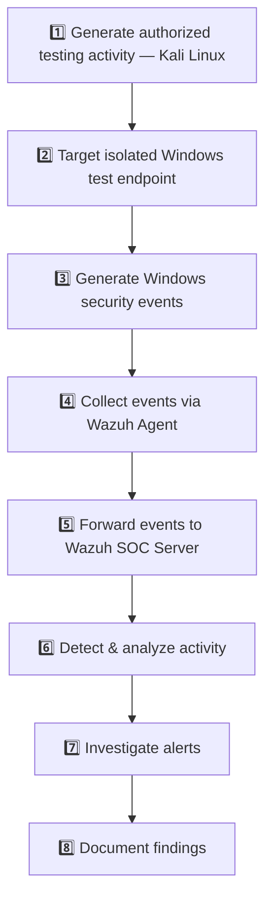
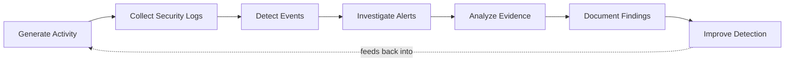

<p align="center">
  
</p>

<p align="center">
  
</p>

<p align="center">
  
  
  
</p>

<p align="center">
  
  
  
  
  
  
</p>

<p align="center">
  A hands-on <b>Security Operations Center (SOC)</b> home lab built to practice SIEM monitoring, Windows event analysis, endpoint monitoring, threat detection, and incident investigation.
</p>

---

## 📑 Table of Contents

- [📖 Overview](#overview)
- [🏗️ Lab Architecture](#lab-architecture)
- [🧰 Technologies Used](#technologies-used)
- [🧩 Lab Components](#lab-components)
- [🔍 Security Event Investigation](#security-event-investigation)
- [🧭 Investigation Methodology](#investigation-methodology)
- [🎓 SOC Skills Practiced](#soc-skills-practiced)
- [⚔️ Authorized Attack Simulation](#authorized-attack-simulation)
- [🚦 Future SOC Development](#future-soc-development)
- [🔄 Learning Methodology](#learning-methodology)
- [🗺️ Project Roadmap](#project-roadmap)
- [📁 Repository Structure](#repository-structure)
- [🎓 Learning Goals](#learning-goals)
- [⚠️ Disclaimer](#disclaimer)
- [👤 Author](#author)

---

## 📖 Overview

The lab consists of a centralized **Wazuh SOC Server**, a monitored **Windows 10 endpoint**, and a **Kali Linux** virtual machine used for authorized security testing. The current environment collects security events generated on the Windows endpoint — including controlled, Kali-originated authentication testing — through the Wazuh platform, inside an isolated and authorized lab network.

<table>
<tr>
<td valign="top" width="50%">

**🎯 Current Objectives**
- Build a functional SOC lab
- Deploy and configure Wazuh
- Monitor Windows endpoints
- Collect Windows Event Logs
- Investigate authentication events
- Analyze successful and failed logons
- Practice SIEM queries and filtering
- Learn event correlation
- Develop SOC investigation skills
- Integrate Kali Linux as an authorized security-testing VM
- Perform a controlled, authorized attack simulation
- Detect and investigate Kali-originated activity in Wazuh

</td>
<td valign="top" width="50%">

**🔮 Future Objectives**
- Expand attack simulation scenarios
- Create custom detection rules
- Map activity to MITRE ATT&CK through custom detections
- Practice incident response
- Build threat hunting skills

</td>
</tr>
</table>

### 📌 Quick Facts

| Item | Detail |
|---|---|
| Agent ID | `002` |
| Agent Name | `MSEDGEWIN10` |
| Agent Status | 🟢 Active |
| Manager | `wazuh-soc-server` |
| Primary Events Investigated | `4624` (Success) · `4625` (Failure) |
| Investigation Window | Aug 1 – Aug 31, 2026 |
| Windows Endpoint IP | `WINDOWS_IP_REDACTED` |
| Kali Test VM IP | `KALI_IP_REDACTED` |
| Kali Test Performed | Controlled SMB authentication (Event `4625`) |
| Wazuh Rule Triggered | `60122` |

---

## 🏗️ Lab Architecture

### Current Environment



### Planned Expansion

Future work will build on this same three-VM architecture by expanding the range of authorized Kali-originated testing (e.g. reconnaissance, brute-force detection scenarios) and by adding custom Wazuh detection rules for the new activity.

> ⚠️ Kali Linux is used only for authorized, controlled security testing inside this isolated home-lab network. See [Disclaimer](#disclaimer).

---

## 🧰 Technologies Used

| Technology | Role in the Lab |
|---|---|
| 🛡️ **Wazuh** | Core SIEM platform — manager, indexer, dashboard, agent |
| 🐧 **Ubuntu Server** | Host OS for the Wazuh SOC Server |
| 🪟 **Windows 10** | Monitored endpoint generating security events |
| 🔌 **Wazuh Agent** | Forwards Windows Event Logs to the manager |
| 💻 **VMware Workstation Player** | Virtualization platform for the lab |
| 📄 **Windows Event Logs** | Source of authentication & system events |
| 📊 **SIEM** | Security monitoring, correlation & alerting |
| 🐉 **Kali Linux** | Authorized security testing and controlled attack simulation |
| 🐙 **GitHub** | Documentation & version control |

---

## 🧩 Lab Components

### 1️⃣ Wazuh SOC Server
Running on **Ubuntu Server**, the Wazuh SOC Server provides centralized security monitoring and is responsible for:

- Receiving endpoint logs
- Processing security events
- Storing and indexing security data (Wazuh Indexer)
- Monitoring agents
- Detecting suspicious activity
- Generating alerts
- Supporting log investigations
- Providing centralized security visibility

> The Wazuh Dashboard is accessed through a web browser from the Windows machine.

### 2️⃣ Windows 10 Endpoint
A Windows 10 virtual machine configured as the monitored endpoint, used to generate and monitor:

- Windows Security Events
- Authentication events (successful & failed logons)
- System events
- Endpoint activity

### 3️⃣ Wazuh Agent

The Wazuh Agent was successfully installed and connected to the Wazuh SOC Server, forwarding Windows Event Logs to the platform for analysis.

| Field | Value |
|---|---|
| Agent ID | `002` |
| Agent Name | `MSEDGEWIN10` |
| Status | 🟢 Active |
| Manager | `wazuh-soc-server` |

### 4️⃣ Kali Linux VM

Kali Linux is the authorized security-testing machine used inside the isolated home-lab network — not an unrestricted attack platform. It is used only to generate controlled, authorized testing activity against the Windows 10 endpoint.

Kali has so far been used to:

- Confirm SMB connectivity to the Windows endpoint
- Perform a single controlled failed SMB authentication attempt
- Generate Windows Security Event ID `4625` for investigation

---

## 🔍 Security Event Investigation

The **Wazuh Discover** interface was used to investigate Windows authentication events — both locally-originated activity and a controlled network-originated test from the Kali Linux VM — focused on the following Windows Security Event IDs.

### 🟢 Event ID 4624 — Successful Logon

Windows Event ID `4624` indicates that a logon attempt was successful.

```
agent.id:002 AND data.win.system.eventID:4624
```

**Fields reviewed:** Agent ID · Agent Name · Event ID · Target Username · Source IP Address · Logon Type · Authentication Package · Process Name · Workstation Name · Timestamp

The investigation identified multiple successful logon events, reviewed to understand normal authentication activity on the endpoint.

### 🔴 Event ID 4625 — Failed Logon

Windows Event ID `4625` indicates that a logon attempt failed.

```
agent.id:002 AND data.win.system.eventID:4625
```

**Fields reviewed:** Agent ID · Agent Name · Event ID · Target Username · Failure Reason · Status Code · Sub-status Code · Logon Type · Source IP Address · Authentication Package · Process Name · Workstation Name · Timestamp

| Field | Observed Value |
|---|---|
| Event ID | `4625` |
| Target Username | `IEUser` |
| Source IP Address | `LOCALHOST_REDACTED` |
| Logon Type | `2` |
| Authentication Package | `Negotiate` |
| Process Name | `C:\Windows\System32\svchost.exe` |
| Failure Reason | `Unknown user name or bad password` |

Multiple failed authentication events were identified and reviewed.

### 👤 Specific User Investigation — `IEUser`

```
# Failed logons
agent.id:002 AND data.win.system.eventID:4625 AND data.win.eventdata.targetUserName:"IEUser"

# Successful logons
agent.id:002 AND data.win.system.eventID:4624 AND data.win.eventdata.targetUserName:"IEUser"
```

### 🧾 Initial Investigation Findings

- Event ID `4625` represented failed logon attempts; `4624` represented successful logons
- Both event types originated from **Agent ID 002** (`MSEDGEWIN10`)
- The investigated username was **`IEUser`**, source IP **`LOCALHOST_REDACTED`**
- Activity appeared to originate locally from the endpoint
- No immediate evidence of an external source was identified during the initial review
- Multiple events from the same agent and IP do not, on their own, indicate malicious activity
- This investigation was limited to currently available events — an **initial** analysis of authentication activity

### 🌐 Event ID 4625 — Kali SMB Authentication Failure (Network-Originated)

A controlled SMB authentication test was performed from the Kali Linux VM against the Windows 10 endpoint to generate a network-originated failed authentication event and validate detection end-to-end.

Command used:

```
smbclient -L //WINDOWS_IP_REDACTED -U IEUser
```

A deliberately incorrect password was entered once. Kali returned:

```
session setup failed: NT_STATUS_LOGON_FAILURE
```

This generated Windows Security Event ID `4625`, investigated in Wazuh Discover using the same query pattern as above.

| Field | Value |
|---|---|
| Event ID | `4625` |
| Source IP | `KALI_IP_REDACTED` |
| Workstation | `KALI` |
| Target Username | `IEUser` |
| Logon Type | `3` (Network) |
| Authentication Package | `NTLM` |
| Status | `0xc000006d` |
| SubStatus | `0xc000006a` |
| Wazuh Rule | `60122` (Level 5) |

Comparing this event against the earlier local Event 4625 (Source IP `LOCALHOST_REDACTED`, Workstation `MSEDGEWIN10`, Logon Type `2`) shows how additional Windows event fields — source IP, workstation name, and logon type — distinguish local authentication activity from a network-originated authentication attempt.

📄 Full investigation: [`docs/investigations/event-4625-kali-smb-authentication.md`](docs/investigations/event-4625-kali-smb-authentication.md)

🖼️ Evidence: [Event Results](assets/screenshots/06-event-4625-kali-smb-results.png) · [Authentication Details](assets/screenshots/07-event-4625-kali-smb-authentication-details.png) · [Rule & MITRE Mapping](assets/screenshots/08-event-4625-kali-smb-rule-mitre-mapping.png)

> This was a single controlled, authorized authentication test — not a real compromise. The MITRE ATT&CK mapping shown by Wazuh Rule 60122 is rule metadata and does not, by itself, confirm the mapped technique occurred.

> Future attack simulations will allow more advanced detection and correlation exercises.

---

## 🧭 Investigation Methodology

<details open>
<summary><b>Click to expand the investigation process</b></summary>
<br/>

| Step | Action | Detail |
|---|---|---|
| 1 | **Access Wazuh Dashboard** | Opened from the Windows machine via web browser; the Wazuh SOC Server ran on the Ubuntu Server VM |
| 2 | **Verify Agent Status** | Confirmed Agent `002` (`MSEDGEWIN10`) was Active |
| 3 | **Select Investigation Time Range** | Configured Wazuh Discover for `Aug 1 – Aug 31, 2026` |
| 4 | **Investigate Failed Logons** | `agent.id:002 AND data.win.system.eventID:4625` |
| 5 | **Investigate Successful Logons** | `agent.id:002 AND data.win.system.eventID:4624` |
| 6 | **Investigate Specific Username** | Filtered both event types on `targetUserName:"IEUser"` |
| 7 | **Compare Events** | Compared username, agent, source IP, logon type, process name, timestamp, auth package & failure reason to assess whether activity was expected or suspicious |
| 8 | **Establish Authentication Baseline** | Confirmed normal local authentication patterns before introducing external testing |
| 9 | **Perform Controlled Kali Testing** | Ran a single authorized SMB authentication attempt from Kali against the Windows endpoint |
| 10 | **Verify Event in Wazuh** | Located the resulting Event `4625` in Wazuh Discover and confirmed Kali as the source |
| 11 | **Analyze & Document** | Analyzed source IP, workstation, logon type, and authentication package, then documented evidence with screenshots |

</details>

---

## 🎓 SOC Skills Practiced

<p align="left">
             
</p>

---

## ⚔️ Authorized Attack Simulation

The lab has been expanded with a **Kali Linux** virtual machine, used only inside the authorized and isolated virtual lab environment.

**✅ Completed:**
- Kali Linux deployment
- Isolated lab networking
- Kali → Windows connectivity / SMB reconnaissance
- A single controlled failed SMB authentication attempt
- Windows Event `4625` generation from Kali
- Wazuh detection & investigation of the resulting event
- Evidence collection and documentation

**🔜 Future:**
- Additional attack simulation scenarios (network discovery, port scanning, brute-force detection)
- Custom Wazuh detection rules
- Alert correlation and threat hunting exercises

This is the general workflow already followed for the completed SMB authentication test, and will be reused for future scenarios:



**Planned scenarios:**

| Category | Scenarios |
|---|---|
| Reconnaissance | Network discovery · Port scanning · SMB reconnaissance ✅ *(completed)* |
| Authentication Attacks | Auth attack simulation ✅ *(completed — SMB authentication test)* · Brute-force detection scenarios |
| Endpoint Activity | Suspicious process activity · File modification monitoring · File Integrity Monitoring |
| Advanced | Malware simulation (safe techniques) · Privilege escalation detection |
| Detection Engineering | Custom Wazuh rules · Alert correlation · Threat hunting exercises |

> ⚠️ All testing remains inside the authorized home-lab environment.

---

## 🚦 Future SOC Development

<table>
<tr><td width="25%" valign="top">

**🛠️ Detection Engineering**
- Create custom Wazuh rules
- Improve alert accuracy
- Reduce false positives
- Create detection logic

</td><td width="25%" valign="top">

**🕵️ Threat Hunting**
- Search for suspicious patterns
- Investigate unusual auth behavior
- Analyze endpoint activity
- Correlate multiple events

</td><td width="25%" valign="top">

**🚨 Incident Response**
- Create investigation reports
- Document timelines
- Identify indicators of compromise
- Record containment recommendations

</td><td width="25%" valign="top">

**🗺️ MITRE ATT&CK**
- Map future simulations
- Map detections to techniques
- Align with industry framework

</td></tr>
</table>

---

## 🔄 Learning Methodology

This project follows a practical, hands-on, and cyclical learning approach:



> The objective is not only to understand cybersecurity concepts theoretically, but to develop practical investigation skills.

---

## 🗺️ Project Roadmap

<p align="left">

</p>

<details open>
<summary><b>✅ Phase 1 — SOC Lab Setup</b> &nbsp;</summary>
<br/>

- [x] Install VMware
- [x] Deploy Ubuntu Server
- [x] Install Wazuh
- [x] Access Wazuh Dashboard
- [x] Deploy Windows 10 endpoint
- [x] Install Wazuh Agent
- [x] Connect Windows endpoint to Wazuh

</details>

<details open>
<summary><b>✅ Phase 2 — Log Analysis</b> &nbsp;</summary>
<br/>

- [x] Collect Windows Event Logs
- [x] Investigate Event ID 4624
- [x] Investigate Event ID 4625
- [x] Filter events by Agent ID
- [x] Investigate specific username
- [x] Compare successful and failed authentication events

</details>

<details open>
<summary><b>✅ Phase 3 — Attack Simulation</b> &nbsp;</summary>
<br/>

- [x] Deploy Kali Linux
- [x] Configure isolated lab networking
- [x] Perform authorized security testing
- [x] Perform SMB reconnaissance
- [x] Generate a controlled failed SMB authentication attempt (Event `4625`)
- [x] Monitor and investigate the event in Wazuh
- [x] Identify the Kali source IP and workstation
- [x] Document findings with evidence screenshots

</details>

<details>
<summary><b>🔜 Phase 4 — Advanced Detection</b> &nbsp;</summary>
<br/>

- [ ] Create custom Wazuh rules
- [ ] Configure custom alerts
- [ ] Perform threat hunting
- [ ] Map events to MITRE ATT&CK
- [ ] Create incident response reports

</details>

**Also upcoming:** expanding attack simulation scenarios and building custom Wazuh detection rules for Phase 4.

---

## 📁 Repository Structure

<details>
<summary><b>Click to view repository structure</b></summary>
<br/>

```
wazuh-soc-home-lab/
│
├── README.md
├── LICENSE
│
├── assets/
│   ├── banner-circuit.svg
│   └── screenshots/
│       ├── 01-wazuh-discover-event-4624-results.png
│       ├── 02-event-4624-authentication-details.png
│       ├── 03-event-4624-rule-mitre-mapping.png
│       ├── 04-event-4625-authentication-details.png
│       ├── 05-event-4625-rule-mitre-mapping.png
│       ├── 06-event-4625-kali-smb-results.png
│       ├── 07-event-4625-kali-smb-authentication-details.png
│       └── 08-event-4625-kali-smb-rule-mitre-mapping.png
│
└── docs/
    └── investigations/
        ├── event-4624-successful-logon.md
        ├── event-4625-investigation.md
        └── event-4625-kali-smb-authentication.md
```

</details>

---

## 🎓 Learning Goals

<table>
<tr><td width="50%">

- Security Operations Center operations
- Blue Team security
- SIEM technologies
- Wazuh
- Log analysis
- Threat detection

</td><td width="50%">

- Endpoint monitoring
- Windows security events
- Incident investigation
- Threat hunting
- Detection engineering

</td></tr>
</table>

---

## ⚠️ Disclaimer

This project is strictly for **educational purposes** and **authorized cybersecurity testing**.

All security testing, simulations, and experiments are performed only inside a **controlled and isolated virtual lab environment**. No unauthorized systems, networks, accounts, or devices are targeted. Kali Linux is used only for authorized security testing against the Windows VM inside this controlled and isolated home-lab network.

---

## 👤 Author

<p align="center">
<b>Daniyal Janjua</b><br/>
Cybersecurity Student · SOC Analyst Aspirant
</p>

<p align="center">
Building practical hands-on skills in Cybersecurity · SOC Operations · Wazuh · SIEM · Blue Team Security · Threat Detection · Log Analysis · Incident Investigation · Threat Hunting · Detection Engineering
</p>

<p align="center">
  <a href="https://github.com/daniyal-sec">
    
  </a>
  <a href="https://github.com/daniyal-sec">
    
  </a>
</p>

<p align="center">
  <sub>Wazuh · SIEM · Windows Event Log Analysis · Blue Team Practice</sub>
</p>
