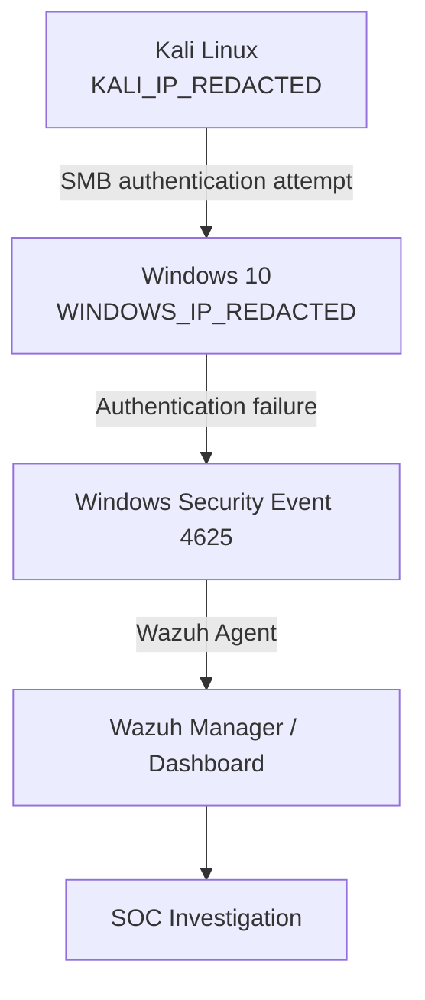
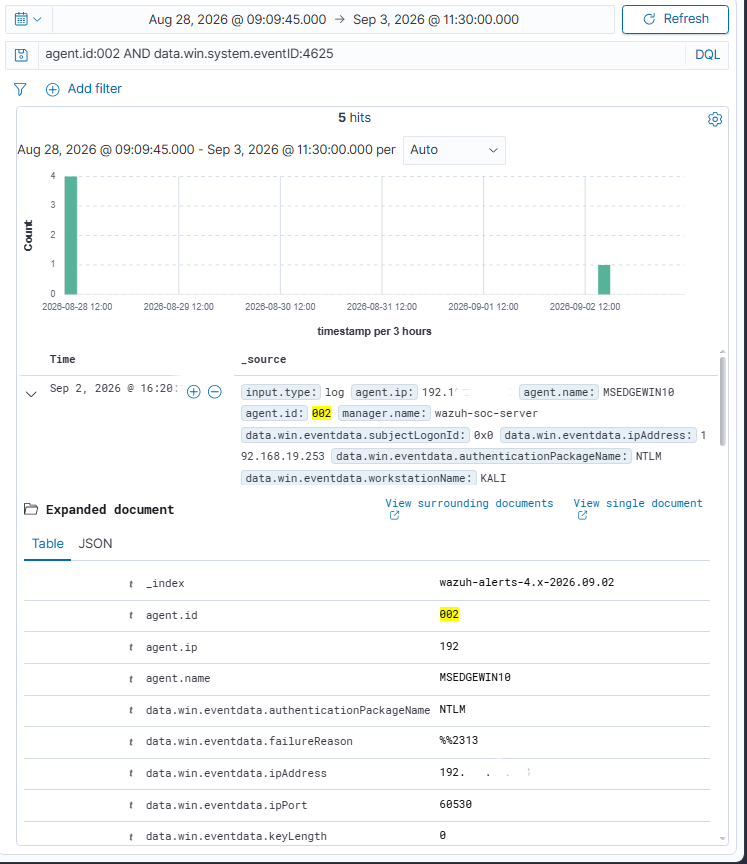
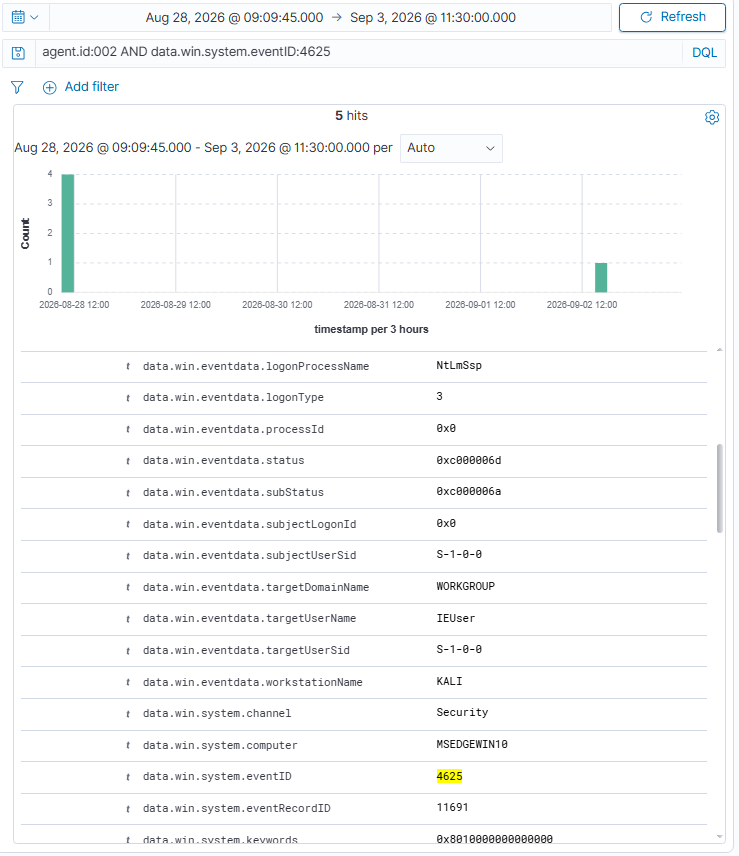
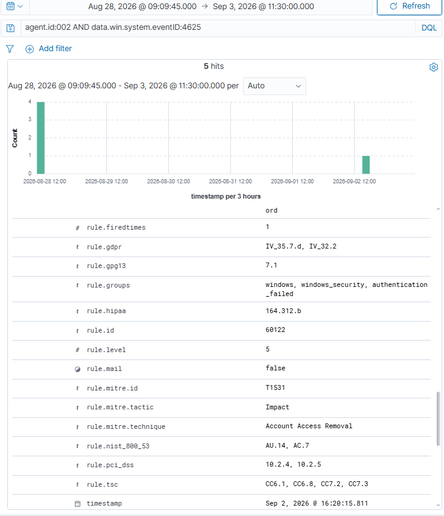
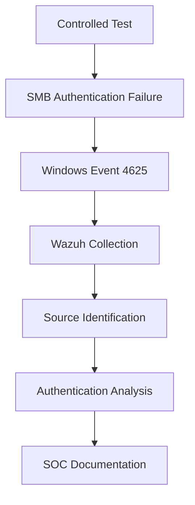

# Investigation: Kali SMB Authentication Failure

---

## 📑 Table of Contents

- [Overview](#overview)
- [Lab Environment](#lab-environment)
- [Objective](#objective)
- [Attack Simulation](#attack-simulation)
- [Authentication Flow](#authentication-flow)
- [Wazuh Detection](#wazuh-detection)
- [Key Event Findings](#key-event-findings)
- [Authentication Details](#authentication-details)
- [Logon Type Analysis](#logon-type-analysis)
- [Failure Status](#failure-status)
- [Wazuh Rule](#wazuh-rule)
- [MITRE ATT&CK Mapping](#mitre-attck-mapping)
- [Evidence](#evidence)
- [Investigation Assessment](#investigation-assessment)
- [Comparison With Previous 4625 Investigation](#comparison-with-previous-4625-investigation)
- [SOC Analyst Takeaway](#soc-analyst-takeaway)
- [Conclusion](#conclusion)

---

## Overview

This investigation documents a controlled SMB authentication test performed from a Kali Linux attacker VM against a Windows 10 endpoint in the Wazuh SOC Home Lab.

The objective was to generate a realistic network-originated failed authentication event and investigate how the activity appears in Windows Security logs and Wazuh.

The test was performed in an isolated and authorized home lab environment.

---

## Lab Environment

*IP addresses below have been redacted for this public write-up.*

| Component | Role |
|---|---|
| Ubuntu Server | Wazuh SOC Server |
| Windows 10 VM | Monitored Endpoint |
| Kali Linux VM | Authorized Attack/Test Machine |
| Wazuh Agent | Agent ID `002` |
| Windows Endpoint | `MSEDGEWIN10` |
| Windows IP | `WINDOWS_IP_REDACTED` |
| Kali IP | `KALI_IP_REDACTED` |

---

## Objective

The objective of this test was to:

1. Confirm SMB connectivity between Kali and Windows.
2. Perform a single controlled failed SMB authentication attempt.
3. Generate Windows Security Event ID `4625`.
4. Confirm that the authentication originated from the Kali VM.
5. Investigate the resulting event in Wazuh.
6. Identify the authentication type and relevant security telemetry.
7. Document the detection as SOC investigation evidence.

---

## Attack Simulation

The authentication test was performed from Kali Linux using `smbclient`.

Command used:

    smbclient -L //WINDOWS_IP_REDACTED -U IEUser

The command requests a list of SMB shares from the Windows endpoint while authenticating as the specified user.

A deliberately incorrect password was entered once for the controlled test.

The resulting response was:

    session setup failed: NT_STATUS_LOGON_FAILURE

This confirmed that the SMB authentication attempt reached the Windows endpoint and that authentication failed.

---

## Authentication Flow

The controlled test followed this path:

    Kali Linux
    KALI_IP_REDACTED
          |
          | SMB authentication attempt
          v
    Windows 10
    WINDOWS_IP_REDACTED
          |
          | Authentication failure
          v
    Windows Security Event 4625
          |
          | Wazuh Agent
          v
    Wazuh Manager / Dashboard
          |
          v
    SOC Investigation

*Visual summary of the same flow:*

---

## Wazuh Detection

The resulting event was located in Wazuh Discover using:

    agent.id:002 AND data.win.system.eventID:4625

The event was associated with the Windows endpoint:

- Agent ID: `002`
- Agent Name: `MSEDGEWIN10`
- Windows Event ID: `4625`
- Windows Security Channel: `Security`

---

## Key Event Findings

### Source Information

The most important finding was the source IP recorded in the Windows authentication event:

    data.win.eventdata.ipAddress: KALI_IP_REDACTED

This corresponds to the Kali Linux VM.

The Windows event also identified the originating workstation as:

    data.win.eventdata.workstationName: KALI

This provides two independent indicators that the failed authentication attempt originated from the Kali test machine.

---

## Authentication Details

The event contained the following relevant authentication information:

| Field | Value |
|---|---|
| Event ID | `4625` |
| Source IP | `KALI_IP_REDACTED` |
| Source Port | `60530` |
| Workstation | `KALI` |
| Target Username | `IEUser` |
| Target Domain | `WORKGROUP` |
| Logon Type | `3` |
| Authentication Package | `NTLM` |
| Logon Process | `NtLmSsp` |
| Status | `0xc000006d` |
| SubStatus | `0xc000006a` |

---

## Logon Type Analysis

The event reported:

    Logon Type: 3

Windows Logon Type `3` represents a network logon.

This is consistent with the SMB authentication test because the authentication request originated from another machine rather than from an interactive session on the Windows endpoint.

The observed combination of:

    Source IP: KALI_IP_REDACTED
    Workstation: KALI
    Logon Type: 3
    Event ID: 4625

provides strong evidence that this was a network-based authentication failure originating from the Kali VM.

---

## Failure Status

The event reported:

    Status: 0xc000006d

and:

    SubStatus: 0xc000006a

The status indicates a failed logon attempt, while the observed substatus is consistent with an incorrect password.

This matches the intentionally incorrect password used during the controlled SMB authentication test.

---

## Wazuh Rule

The event triggered Wazuh Rule:

    Rule ID: 60122

Observed rule level:

    Level: 5

Rule groups included:

    windows
    windows_security
    authentication_failed

The rule description identified the activity as:

    Logon Failure - Unknown user or bad password

---

## MITRE ATT&CK Mapping

The Wazuh rule displayed the following MITRE ATT&CK mapping:

| Field | Value |
|---|---|
| Technique ID | `T1531` |
| Technique | Account Access Removal |
| Tactic | Impact |

### Important Note

The MITRE ATT&CK mapping shown above is part of the Wazuh rule metadata.

The presence of this mapping does **not** by itself establish that the MITRE technique was actually performed during this test.

The observed activity was a controlled failed SMB authentication attempt that generated Windows Event `4625`.

---

## Evidence

### Screenshot 1 — Wazuh Event Results

This screenshot shows the Wazuh Discover results and the event fields identifying the Kali source IP and Windows endpoint.

---

### Screenshot 2 — Authentication Details

This screenshot shows the authentication-specific fields, including:

- Logon Type `3`
- Source IP `KALI_IP_REDACTED`
- Workstation `KALI`
- Target username `IEUser`
- NTLM authentication
- Status and SubStatus values
- Windows Event ID `4625`

---

### Screenshot 3 — Wazuh Rule and MITRE Mapping

This screenshot shows Wazuh Rule `60122`, its severity level, authentication failure classification, and the associated MITRE ATT&CK metadata.

---

## Investigation Assessment

The event represents a confirmed network-originated failed authentication attempt against the Windows endpoint.

The evidence supports the following sequence:

    1. Kali initiated an SMB connection to Windows.
    2. SMB authentication was requested using the IEUser account.
    3. An incorrect password was supplied.
    4. Windows generated Security Event 4625.
    5. Windows recorded Kali as the source workstation.
    6. Windows recorded KALI_IP_REDACTED as the source IP.
    7. Logon Type 3 identified the activity as a network logon.
    8. Wazuh collected and classified the event using Rule 60122.

---

## Comparison With Previous 4625 Investigation

This investigation is useful because it can be compared with the earlier locally generated failed authentication events.

### Earlier Local Event

    Source IP: LOCALHOST_REDACTED
    Workstation: MSEDGEWIN10
    Logon Type: 2

### Kali SMB Event

    Source IP: KALI_IP_REDACTED
    Workstation: KALI
    Logon Type: 3

The second event provides a clear example of how a network-originated authentication failure appears in Windows and Wazuh telemetry.

---

## SOC Analyst Takeaway

This investigation demonstrates the importance of examining more than just the Windows Event ID.

Event `4625` alone indicates a failed logon, but additional fields provide the context required for investigation.

The following fields were particularly useful:

- Source IP
- Workstation Name
- Logon Type
- Target Username
- Authentication Package
- Status
- SubStatus

Together, these fields allowed the failed authentication attempt to be attributed to the Kali test machine and identified as a network-based SMB authentication attempt.

---

## Conclusion

The controlled SMB authentication test successfully generated and detected a network-originated Windows Event `4625`.

The Wazuh SOC environment successfully collected the event and exposed the relevant authentication telemetry, allowing the activity to be traced back to the Kali Linux VM.

This investigation demonstrates the complete detection workflow:

    Controlled Test
          ↓
    SMB Authentication Failure
          ↓
    Windows Event 4625
          ↓
    Wazuh Collection
          ↓
    Source Identification
          ↓
    Authentication Analysis
          ↓
    SOC Documentation

This forms a practical example of endpoint authentication monitoring and SIEM-based investigation within the Wazuh SOC Home Lab.

*Visual summary of the same workflow:*

